# 🛡️ SentinelNet: Automated Network Security & Phishing Classification Engine

SentinelNet is a state-of-the-art, end-to-end MLOps network security platform. It automates URL feature extraction, trains robust machine learning ensembles, tracks experimental telemetry, and deploys high-throughput classification microservices via declarative GitOps pipelines.

The platform includes a gorgeous cyberpunk glassmorphic React dashboard, a high-throughput FastAPI prediction engine, and an automated production-ready MLOps training highway.

---

## 🚀 Key Platform Capabilities

* **Automated 30-Feature Extraction**: Dynamically parses target URLs or IP addresses in real time to extract 30 distinct security/reputation metrics (e.g., SSL certificate validity, prefix-suffix anchors, redirect counts, and domain trust scores).
* **Cyberpunk Command Center**: An interactive React + Tailwind CSS client offering glassmorphic panels, real-time telemetry graphs, preset safe/phishing URLs, and instant threat assessments with responsive visual feedback.
* **5-Classifier Ensemble Pool**: Automates hyperparameter search and evaluates five distinct machine learning models (Random Forest, Decision Tree, Gradient Boosting, Logistic Regression, and AdaBoost) to select the optimal predictor.
* **Automated Schema & Drift Validation**: Integrates Great Expectations for column format integrity and Evidently AI for data drift monitoring.
* **Declarative GitOps & Kubernetes Deployments**: Structured manifests integrated with ArgoCD for continuous synchronization to Kubernetes clusters.
* **Comprehensive Metrics & Lineage Tracing**: Instrumented with Prometheus `/metrics` exporters for FastAPI runtime latency and Marquez/OpenLineage for pipeline telemetry.

---

## 🕸️ MLOps Pipeline Architecture

The SentinelNet platform implements a structured, 6-stage vertical MLOps highway that matches the Python packages in the backend step-for-step:

```mermaid
graph TD
    A["01 / DATA_INGESTION (MongoDB)"] -->|Train/Test Splits| B["02 / GE & EVIDENTLY_AI (Validation)"]
    B -->|Cleaned Schema & Drift Report| C["03 / DATA_TRANSFORMATION (KNN Imputer)"]
    C -->|Transformed Arrays| D["04 / MODEL_TRAINER (Ensembles Search)"]
    D -->|Best Estimator Metrics| E["05 / DAGSHUB_MLFLOW (Registry)"]
    E -->|ArgoCD Sync Manifest| F["06 / KUBERNETES (ArgoCD GitOps)"]
    
    style A fill:#1c1b1b,stroke:#dfb7ff,stroke-width:1px
    style B fill:#1c1b1b,stroke:#dfb7ff,stroke-width:1px
    style C fill:#1c1b1b,stroke:#dfb7ff,stroke-width:1px
    style D fill:#1c1b1b,stroke:#dfb7ff,stroke-width:1px
    style E fill:#1c1b1b,stroke:#dfb7ff,stroke-width:1px
    style F fill:#1c1b1b,stroke:#dfb7ff,stroke-width:1px
```



### 1. Data Ingestion (`data_ingestion.py`)
* Extracts raw threat dataset collections from a secure **MongoDB** database.
* Splits the loaded dataset into high-integrity training and testing partitions (`train.csv` / `test.csv`) and saves them to local MLOps storage directories.

### 2. Data Validation (`data_validation.py`)
* Employs **Great Expectations (`ge`)** to mathematically assert and validate columns, ensuring dataset schema structure matches the predefined `data_schema/schema.yaml`.
* Utilizes **Evidently AI** metrics (`DataDriftTable`) to evaluate features for covariate drift compared against baseline distributions.

### 3. Data Transformation (`data_transformation.py`)
* Sets up a robust scikit-learn standard preprocessing `Pipeline`.
* Handles missing values using an adaptive **`KNNImputer`** to ensure clean, standardized, and imputed floating arrays before model feeding.

### 4. Model Trainer (`model_trainer.py`)
* Performs grid-searches and evaluations across a pool of **5 Ensemble Models**:
  1. *Random Forest Classifier*
  2. *Decision Tree Classifier*
  3. *Gradient Boosting Classifier*
  4. *Logistic Regression*
  5. *AdaBoost Classifier*
* Filters trained classifiers against performance thresholds to output the ultimate best model pickle (`model.pkl`).

### 5. Model Registry (`dagshub` / `mlflow`)
* Connects dynamically to your secure **DagsHub MLflow tracking endpoint**.
* Logs model hyper-parameters and performance metrics (F1-score, Precision, and Recall).
* Registers the selected best model under the alias `'NetworkSecurityModel'` on the centralized registry portal.

### 6. Kubernetes GitOps (`k8s/` / `ArgoCD`)
* Generates target container images of the API engine (`strengthftw/network-security:latest`).
* Automatically deploys and balances microservices using Declarative GitOps files via **ArgoCD** pointing to the in-cluster Kubernetes control plane.

---

## 📁 Repository Structure

```ascii
NetworkSecurity/
├── networksecurity/               # Core Python ML Package
│   ├── components/                # Ingestion, Transformation, Validation, Trainer
│   ├── constant/                  # Constant strings, schemas, and configurations
│   ├── entity/                    # Config and Artifact entities definitions
│   └── pipeline/                  # training_pipeline & batch_prediction scripts
├── frontend/                      # Cyberpunk React Dashboard
│   ├── src/
│   │   ├── App.jsx                # UI components & Flowchart rendering
│   │   └── index.css              # Glassmorphic dark-mode stylesheets
│   └── package.json
├── k8s/                           # Declarative GitOps Deployments
│   ├── argocd-app.yaml            # ArgoCD GitOps application manifest
│   ├── deployment.yaml            # Container replica configuration
│   └── service.yaml               # Cluster IP service balancing
├── app.py                         # FastAPI RESTful API microservice
├── main.py                        # Training Pipeline Entrypoint CLI
├── docker-compose.yml             # Supporting infrastructure definition
└── requirements.txt               # Backend system dependencies
```

---

## 🛠️ Installation & Setup

### Prerequisites
* Python 3.10+
* Node.js 18+ (with `npm`)
* MongoDB Connection URI

### 1. Backend API & Training Environment
Clone the project, set up a virtual environment, and install package dependencies:
```bash
# Set up Python Virtual Environment
python -m venv venv
source venv/bin/activate  # On Windows: .\venv\Scripts\activate

# Install requirements
pip install -r requirements.txt
```

Configure your environment variables inside a `.env` file in the root directory:
```env
MONGO_DB_URL="mongodb+srv://<user>:<password>@cluster.mongodb.net/?retryWrites=true&w=majority"
```

To run a clean model **training run** through the entire MLOps pipeline:
```bash
python main.py
```

To boot up the high-throughput **FastAPI API server**:
```bash
python app.py
```
* **API Documentation**: Access the swagger portal at [http://localhost:8000/docs](http://localhost:8000/docs)
* **Prometheus Metrics**: Access runtime system metrics at [http://localhost:8000/metrics](http://localhost:8000/metrics)

---

### 2. Frontend Cyberpunk Dashboard
Navigate to the frontend folder, install dependencies, and launch the Vite development server:
```bash
cd frontend
npm install
npm run dev
```
Open your browser and navigate to the sleek client interface:
👉 **[http://localhost:5173/](http://localhost:5173/)**

---

### 3. GitOps Kubernetes Deployment
To orchestrate your microservices automatically via GitOps, register the application manifest inside your ArgoCD control plane:
```bash
# Connect and apply k8s manifests locally
kubectl apply -f k8s/argocd-app.yaml
```

---

## 📈 Monitoring & Tracing

* **DagsHub MLflow Registry**: Trace experiments and parameters at your DagsHub workspace.
* **Marquez OpenLineage tracing**: Run `docker-compose up -d` to launch Marquez and access the data lineage tracing dashboard at [http://localhost:3000](http://localhost:3000).
* **Prometheus Scraping**: Collect runtime traffic volume and processing latency metrics directly from the `/metrics` endpoint.
