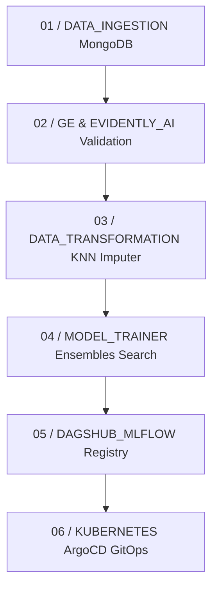

# SentinelNet: Automated Network Security and Phishing Domain Classification

SentinelNet is an end-to-end machine learning operations (MLOps) platform built to classify network threats and detect phishing domains. The system includes a FastAPI backend for prediction, an automated training pipeline using scikit-learn ensembles, and an interactive React web dashboard.

---

## MLOps Pipeline Flow



The training pipeline runs automatically in 6 modular stages:

1. **Data Ingestion** (`data_ingestion.py`): Connects to MongoDB, extracts threat records, and exports training and testing data splits.
2. **Data Validation** (`data_validation.py`): Performs column schema validations with Great Expectations and checks for dataset drift using Evidently AI.
3. **Data Transformation** (`data_transformation.py`): Standardizes and cleans threat metrics using a scikit-learn pipeline with KNNImputer.
4. **Model Trainer** (`model_trainer.py`): Automatically trains and evaluates 5 different classifier ensembles (Random Forest, Decision Tree, Gradient Boosting, Logistic Regression, AdaBoost) to select the best predictor.
5. **Model Registry** (`mlflow`): Logs model metrics and parameters, then registers the best-performing model to the MLflow repository.
6. **Deployment** (`k8s` / `ArgoCD`): Sets up declarative GitOps configurations to manage containerized replicas on a Kubernetes cluster via ArgoCD.

---

## Quick Start Guide

### 1. Run the Backend API and Training Pipeline

To configure the backend, install the packages, run the training pipeline, and start the API server:

```bash
# Install backend dependencies
pip install -r requirements.txt

# Run the full training pipeline
python main.py

# Launch the FastAPI REST API server
python app.py
```

* **Interactive Swagger API Documentation**: http://localhost:8000/docs
* **FastAPI Server Telemetry Metrics**: http://localhost:8000/metrics

---

### 2. Launch the Web Dashboard

To start the interactive frontend dashboard, run these commands in a new terminal:

```bash
# Navigate to the frontend directory
cd frontend

# Install package dependencies
npm install

# Start the local development server
npm run dev
```

Open your browser and navigate to:
http://localhost:5173/

---

## MLOps Technology Stack and Integrated Tools

The SentinelNet platform implements the following tools and technologies as part of its end-to-end MLOps toolchain:

* **Source Code Control & CI**: GitHub and GitHub Actions for continuous integration and automated testing.
* **Model Serving API**: FastAPI for high-performance prediction and training endpoints.
* **Experiment Tracking & Model Registry**: MLflow integrated with DagsHub for parameter, metric logging, and centralized model registry.
* **Containerization**: Docker for packaging high-performance runtime microservice images.
* **Data Quality**: Great Expectations for mathematical column schema and data quality assertions.
* **Feature Management**: Feast Feature Store for local feature schema serving.
* **Data Versioning**: Data Version Control (DVC) for tracking threat datasets without cluttering Git.
* **Data Lineage**: OpenLineage and Marquez for tracking ingestion and transformation lineage graphs.
* **Orchestration**: Kubernetes for container replica scaling and routing.
* **Continuous Deployment**: ArgoCD for declarative GitOps continuous deployment.
* **Interactive Frontend**: ReactJS for the clean dark-mode telemetry client.
* **Drift Monitoring**: Evidently AI for automated dataset drift analysis and reporting.
* **Infrastructure Telemetry**: Prometheus and Grafana for backend exporter metrics and traffic dashboarding.
* **Prompt Management**: Promptfoo for evaluating prompt templates of threat reports.
